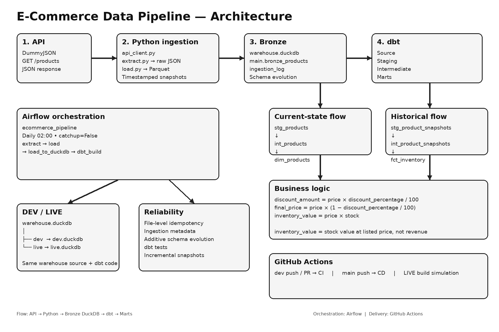

# Local E-Commerce Data Platform

An end-to-end local data pipeline that ingests product snapshots from a REST API, preserves raw data, converts it to Parquet, loads it into DuckDB, transforms it with dbt, and orchestrates the workflow with Airflow.



## Architecture

```text
DummyJSON API
     │ GET /products
     ▼
Python ingestion
     │
     ├── Raw JSON snapshots
     └── JSON → Parquet
              │
              ▼
      Bronze DuckDB
 warehouse.main.bronze_products
              │
              ▼
             dbt
       ┌──────┴──────┐
       ▼             ▼
 Current state    Snapshots
       │             │
       ▼             ▼
 int_products   int_product_snapshots
       │             │
       └──────┬──────┘
              ▼
          dbt marts
       ┌──────┴──────┐
       ▼             ▼
 dim_products   fct_inventory

Airflow: extract → load → load_to_duckdb → dbt_build
GitHub Actions: CI on dev/PR → CD on main
```

## Data Flow

1. **Extract** — `api_client.py` calls `GET https://dummyjson.com/products`.
2. **Raw layer** — the complete API response is saved as timestamped JSON under `data/raw/products/YYYY-MM-DD/`.
3. **Bronze files** — `load.py` converts each new JSON snapshot into Parquet under `data/bronze/products/`.
4. **Bronze warehouse** — `load_to_duckdb.py` loads Parquet into `warehouse.duckdb`, including ingestion metadata and additive schema evolution.
5. **dbt staging** — source data is normalized and separated into current-product and historical-snapshot flows.
6. **Intermediate models** — business metrics are calculated.
7. **Marts** — `dim_products` provides current product attributes; `fct_inventory` provides historical inventory metrics.

## API Request → Response

The ingestion uses a simple GET request:

```http
GET https://dummyjson.com/products
```

The loader expects the JSON response to contain a top-level `products` array:

```json
{
  "products": [
    {
      "id": 1,
      "title": "Example product",
      "price": 100,
      "discountPercentage": 10,
      "stock": 25
    }
  ]
}
```

The full response is retained as a raw snapshot before transformation.

## Business Logic

The intermediate layer derives:

```text
discount_amount = price × discount_percentage / 100
final_price     = price × (1 - discount_percentage / 100)
inventory_value = price × stock
```

`inventory_value` represents the value of currently stocked units at listed price; it is not sales revenue.

## Current vs Historical Data

- `stg_products` selects the latest record for each product.
- `stg_product_snapshots` preserves the snapshot-oriented view.
- `dim_products` contains descriptive current-state attributes.
- `fct_inventory` contains price, discount, stock, inventory value, rating, and `snapshot_at`.

The snapshot model is incremental and uses `snapshot_at` as its watermark. This is efficient for new snapshots, but late-arriving records with an older timestamp can be skipped.

## Airflow

The DAG `ecommerce_pipeline` runs daily at **02:00** with `catchup=False`.

```text
extract
   ↓
load
   ↓
load_to_duckdb
   ↓
dbt_build
```

## DEV / LIVE

dbt has two DuckDB targets:

```text
warehouse.duckdb
      │
      ├── dev  → dev.duckdb
      └── live → live.duckdb
```

DEV is the default local target. LIVE is explicitly selected by CI/CD. There is no automatic dev-to-live database file copy; both targets are built from the same warehouse source and dbt code.

## Data Quality & Reliability

- File-level idempotency prevents the same JSON snapshot from being converted repeatedly.
- `ingestion_log` provides ingestion/audit metadata.
- Additive schema evolution allows newly arriving columns to be added to the bronze table.
- dbt tests validate the transformation layer.
- CI builds the dbt project against a clean temporary DuckDB fixture.

## CI/CD

```text
dev push ──► CI
              │
              ▼
          Pull Request
              │
              ▼
            main
              │
              ▼
             CD
              │
              ▼
       LIVE build simulation
```

GitHub Actions:
- **CI** runs on pushes to `dev` and pull requests targeting `main`.
- **CD** runs on pushes to `main` and executes a LIVE-target dbt build in a clean CI environment.

## Docker

Docker Compose provides the local orchestration environment, including Airflow, PostgreSQL, and dbt documentation.

Typical local endpoints:

```text
Airflow UI   → http://localhost:8080
dbt docs     → http://localhost:8082
```

## Repository Structure

```text
.
├── .github/workflows/
│   ├── dbt-ci.yml
│   └── dbt-cd.yml
├── airflow/dags/
│   └── ecommerce_pipeline.py
├── dbt/ecommerce_dbt/
│   ├── models/
│   │   ├── staging/
│   │   ├── intermediate/
│   │   └── marts/
│   ├── macros/
│   ├── seeds/
│   ├── snapshots/
│   └── tests/
├── profiles/
│   └── profiles.yml
├── src/ingestion/
│   ├── api_client.py
│   ├── extract.py
│   ├── load.py
│   └── load_to_duckdb.py
├── Dockerfile
├── docker-compose.yml
└── requirements.txt
```

## Key Engineering Concepts

- REST API ingestion
- Raw data preservation
- JSON and Parquet processing
- DuckDB analytical warehouse
- dbt staging / intermediate / marts
- Incremental transformation
- Schema evolution
- Idempotent ingestion
- Data quality testing
- Airflow orchestration
- Docker
- GitHub Actions CI/CD
- DEV / LIVE environment separation

## Limitations & Next Steps

This is a local portfolio implementation rather than a cloud production system. Natural next steps include a cloud object-storage landing zone, a managed warehouse, secret management, stronger observability, alerting, and a production BI layer.
