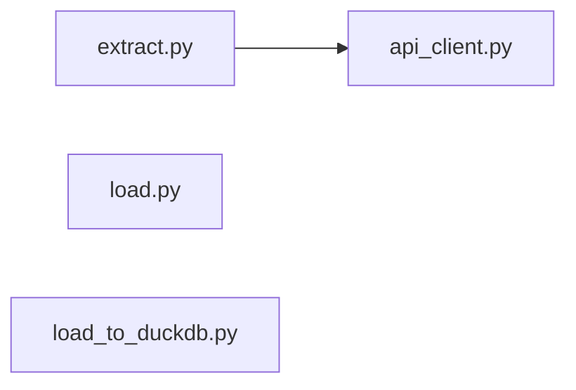

<!-- METADATA: {"source_path": "src/ingestion", "source_sha": "6eff58a95f9ee92ae4156d2c8337a226ac303fcb", "extraction_quality": "full_ast", "model": "gpt-5-mini", "generated_at": "2026-09-08T09:35:32Z", "doc_type": "directory"} -->
[Documentation Home](../../README.md) > [src](../README.md) > [ingestion](./README.md) > **ingestion**

---

# ingestion

> **Directory:** `src/ingestion`

## Purpose

This directory contains ingestion-related utilities for acquiring, preparing, and loading product data within the codebase. It groups a small set of modules that fetch raw product data, convert and prepare datasets, and load Parquet files into DuckDB while tracking ingestion state and handling schema evolution.

## Architecture Diagram

## Files

| File | Description |
| --- | --- |
| `load_to_duckdb.py` | This module provides a focused set of functions to load Parquet files into DuckDB while managing schema evolution, ingestion tracking, and idempotency; it also includes utilities to create and manage an ingestion log and a bronze table, inspect columns, and evolve the destination schema. |
| `load.py` | This module provides lightweight utilities for ingesting and preparing datasets, exposing json_to_parquet for converting JSON files to Parquet and get_unprocessed_files for enumerating files that have not yet been processed. |
| `api_client.py` | This module provides a simple API client for fetching product data from an external HTTP service and exposes a single function, fetch_products, for retrieving product information. |
| `extract.py` | This module contains a utility for extracting and persisting raw product data, importing a time library and the API client's fetch_products function, and exposing save_raw_data to orchestrate fetching product data and saving it with timestamps. |

## API

Public classes, interfaces and functions in this directory, plus exported constants, with signatures and line numbers.

### `api_client.py`

- **`fetch_products()`** — line 5
- **`BASE_URL`** = 'https://dummyjson.com' — line 3

### `extract.py`

- **`save_raw_data(data)`** — line 19
- **`PROJECT_DIR`** = Path(os.getenv('PROJECT_DIR', '/opt/airflow')) — line 11
- **`RAW_DIR`** = PROJECT_DIR / 'data/raw/products' — line 15
- **`local_tz`** = pendulum.timezone('Asia/Jakarta') — line 16
- **`data`** = fetch_products() — line 36

### `load.py`

- **`json_to_parquet(input_file)`** — line 16
- **`get_unprocessed_files()`** — line 41
- **`PROJECT_DIR`** = Path(os.getenv('PROJECT_DIR', '/opt/airflow')) — line 8
- **`RAW_DIR`** = PROJECT_DIR / 'data/raw/products' — line 12
- **`BRONZE_DIR`** = PROJECT_DIR / 'data/bronze/products' — line 13
- **`files_to_process`** = get_unprocessed_files() — line 60

### `load_to_duckdb.py`

- **`create_ingestion_log(con)`** — line 17
- **`create_bronze_table(con, parquet_file)`** — line 32
- **`get_table_columns(con)`** — line 62
- **`get_parquet_columns(con, parquet_file)`** — line 78
- **`evolve_schema(con, parquet_file)`** — line 90
- **`is_processed(con, parquet_file)`** — line 124
- **`get_snapshot_time(parquet_file)`** — line 134
- **`build_insert_query(con, parquet_file)`** — line 160
- **`load_parquet(con, parquet_file)`** — line 223
- **`main()`** — line 332
- **`PROJECT_DIR`** = Path(os.getenv('PROJECT_DIR', '/opt/airflow')) — line 8
- **`JAKARTA_TZ`** = pendulum.timezone('Asia/Jakarta') — line 12
- _…and 2 more_

## Key Components

- **`DuckDB ingestion and schema management`** (in `load_to_duckdb.py`) — This module centralizes the logic for loading Parquet files into DuckDB while tracking what has been ingested and evolving the target table schema, making it the primary mechanism for durable, idempotent data landing in DuckDB within this directory.
- **`JSON-to-Parquet conversion and file selection`** (in `load.py`) — The utilities in this module prepare dataset files for downstream loading by converting JSON to Parquet and identifying unprocessed files, which are prerequisite steps before any DuckDB ingestion can occur.
- **`HTTP product fetcher`** (in `api_client.py`) — fetch_products provides the external data retrieval capability used by extraction workflows in this directory, supplying the raw product records that are subsequently persisted and processed.
- **`Raw data extraction coordinator`** (in `extract.py`) — save_raw_data orchestrates fetching product data and saving raw payloads with timestamps, acting as the entry point that ties external retrieval (api_client.py) to the local raw data storage flow.

## Architecture Notes

The directory is organized into four focused modules: api_client.py exposes a single fetch_products function that performs HTTP retrieval of product data; extract.py imports that function and provides save_raw_data to orchestrate fetching and persisting raw product payloads with associated timestamps. load.py offers file-level utilities to convert JSON to Parquet and to enumerate unprocessed files, preparing data for downstream ingestion. load_to_duckdb.py contains the functions responsible for loading prepared Parquet files into DuckDB, managing ingestion logs, and evolving the destination table schema. Aside from extract.py importing api_client.py, the modules operate as separate utilities that together form a linear ingestion flow: fetch raw data (api_client.py → extract.py), prepare and select files (load.py), and finally load into DuckDB (load_to_duckdb.py).

---

## Navigation

**↑ Parent Directory:** [Go up](../README.md)

---

This README was generated by [DocBot](https://github.com/marketplace/docbot-by-woden) from the structural analysis of the files in this directory. AI-generated content can contain mistakes — verify against the source code before acting on architectural claims.
